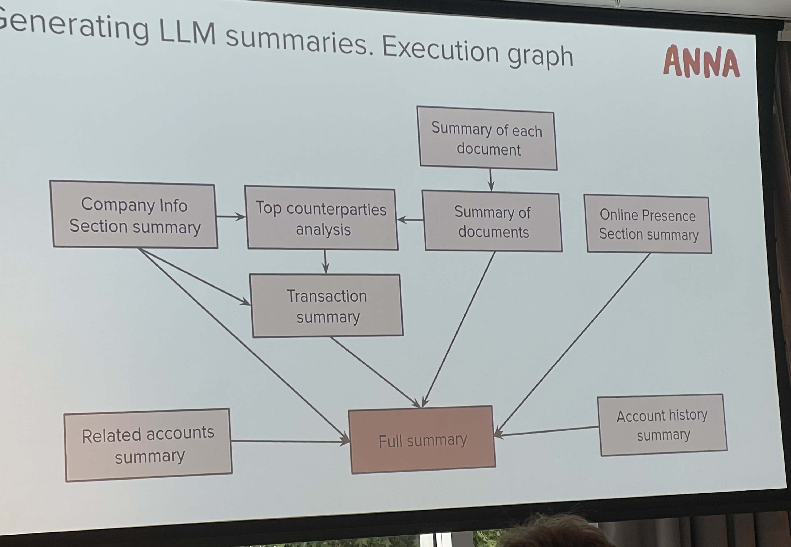

The first was titled **"Enhancing Fraud Detection with LLM-Generated Profiles: From Analyst Efficiency to Model Performance"** and the second was **"Practical Lessons from Building a Real-World Adverse Media Pipeline."**

## Enhancing Fraud Detection with LLM-Generated Profiles: From Analyst Efficiency to Model Performance by [Radion Bikmukhamedov](https://github.com/RadionBik)

This presentation covered how ANNA, a business bank, built a fraud detection model using LLMs and traditional methods.

### What did they do?

They used different information about the company (such as [PUT the information here]—see the picture) to generate company profile summaries.

Then, using those profile summaries, they trained a TF-IDF model and a Logistic Regression model to predict which company profiles were susceptible to fraud.

They developed a fraud model to protect customers from becoming victims of fraud.

The model uses TF-IDF with n-grams from the company profile summaries to predict which companies are susceptible to fraud.

When asked why they didn’t use more sophisticated models for embeddings on top of their classification models, they explained that they opted for TF-IDF for its simplicity.

They evaluated their model using human fraud analysts, who were asked to assess the profiles generated by the LLM to see if they made sense.

This use case taught me how standard NLP models are still powerful in a time when many think LLMs are the magic solution to all problems.

---

## Not Another LLM Talk… Practical Lessons from Building a Real-World Adverse Media Pipeline

Another talk that caught my attention was by the Director of Data Science at Comply Advantage, [Adam Hill](https://www.linkedin.com/in/adambenhill/?originalSubdomain=uk).

He presented the entire process of moving from a proof of concept to a production system in a fully regulated environment.

This talk resonated with me as a Machine Learning Engineer working in a bank—a highly regulated environment.

He outlined the personas involved in a data science project’s production phase and shared tips on how to engage with each one.

Here’s a post describing each of them:

He described:
- **Cautious Claire**, the compliance officer who doesn’t trust AI black boxes.
- **Reinventing Ryan**, the engineer determined to build everything from scratch.
- **Magic Mike**, the sales lead who thinks LLMs can do anything.
- **Paranoid Pete**, the security expert who thinks LLMs will leak all the secrets.
- **Just-Fine-Tune Jenny**, the product manager convinced that fine-tuning will fix everything.

He then discussed how to manage each persona’s expectations.

### How do we get our LLM solution into production?

#### The Governance Person
They want to know why we should trust the model and how we ensure the AI is doing the right thing.

**Solution:** Documentation, documentation, documentation. Ensure all design decisions are well-documented, including why one approach was chosen over another. Make sure experiments are reproducible and that no harm is being done.

They’ll later ask how to evaluate the model.

#### The Sales Lead
Soon after the demo and POC, they’ll tell prospects about the product. But wait—a POC is just a POC.

They care about the impact on the customer, not metrics like precision, recall, or F1 score. They should be the product’s first advocates.

#### Reinventing Ryan
This persona resonates most with developers. Here are a few recommendations:
- Start simple. Use available APIs before considering self-hosting and infrastructure development.
- Today, prompting is often better than fine-tuning. Only fine-tune if prompting isn’t enough.
- Think about scaling and reproducibility. Some LLM APIs get deprecated quickly, making it hard to reproduce experiments. Self-hosting may become necessary.
- For large-scale inference, self-hosting can be the way to go.

#### Paranoid Pete, the Security Expert
They worry about leaking company data via LLMs.

**Solution:** Explain that sensitive data isn’t being sent to the LLM. Ensure prompt versioning and emphasize ongoing monitoring.

They care about:
- What data the LLM can access.
- Whether PII is in the system.
- Prompt access control.
- Version control.
- Ongoing monitoring.

#### Just-Fine-Tune Jenny
They ask if we’re measuring the right things—model performance versus client experience.

**Solution:** Proper evaluation requires human-labeled data. This evaluation helps justify the model’s use to the governance team.

### Conclusion
He wrapped up by highlighting key considerations for LLM applications:
- Start with APIs but plan for obsolescence.
- Governance is critical.
- Documentation is key.
- Security must be considered.
- Prompting often beats fine-tuning.
- Languages are hard.

---

Apart from these presentations, I attended other talks, including one by Jay Almar on the current state of transformer models, a favorite of mine, Ines Montani[], who discussed a new library spaCy is building for PDF documents, and another on LLM arithmetic.

That’s all for Saturday’s presentations. I got to meet brilliant people, had fun, and enjoyed myself. Though, for some reason, I noticed there were no T-shirts at the conference!
